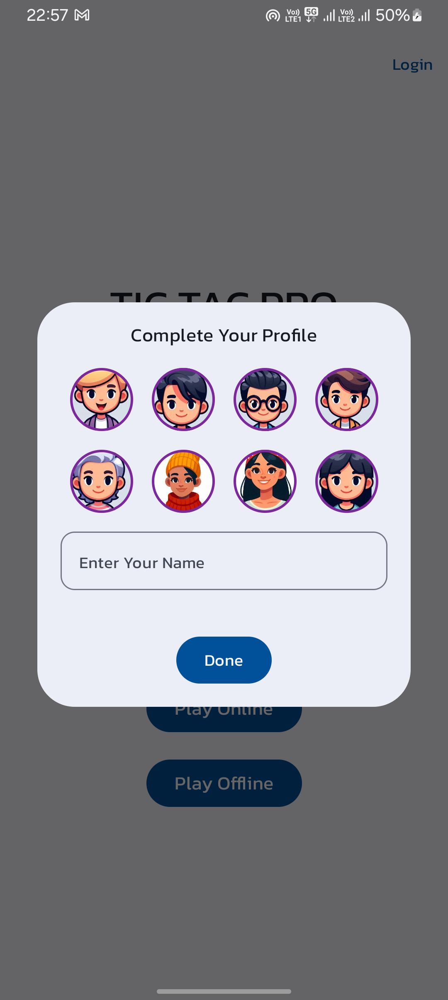
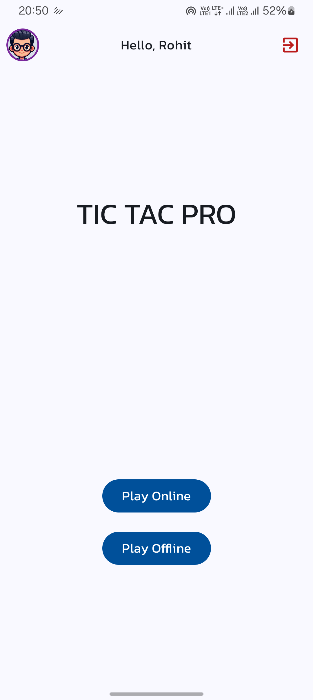
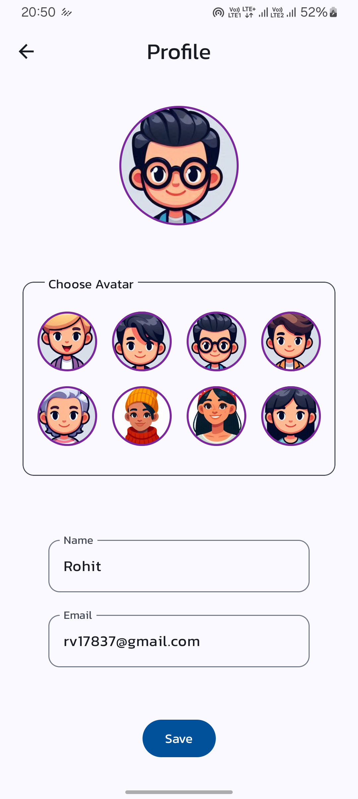
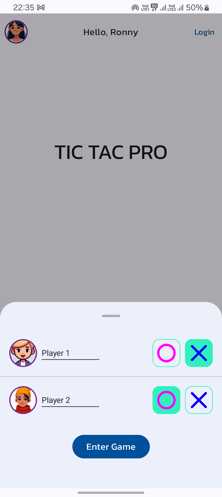
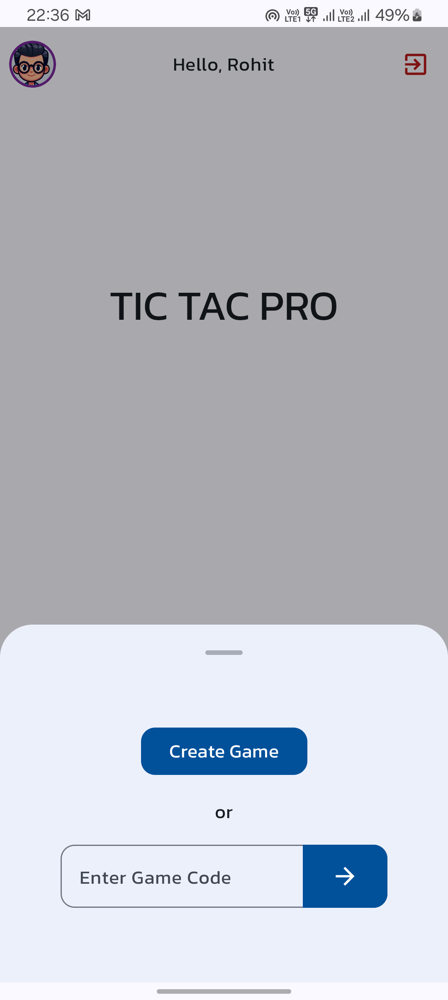
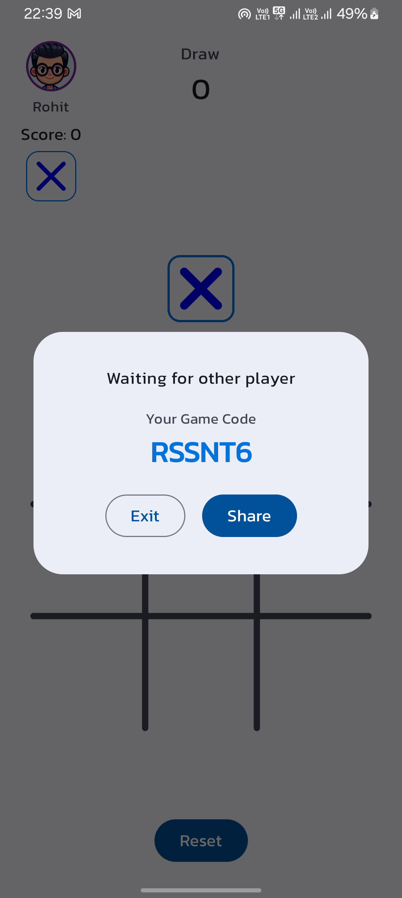
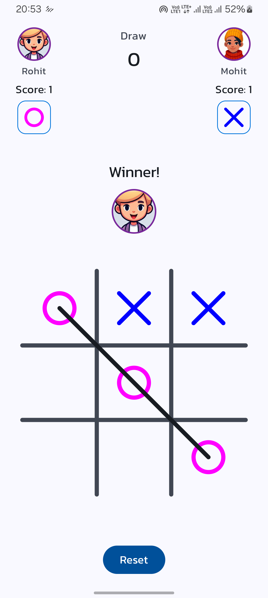

## Tic Tac Pro : *Multiplayer Game*

<p align="center">
  
  
  
  
  
  
  
  
</p>

## Overview
**Tic Tac Pro** is an engaging multiplayer Android game that lets you challenge your friends either online or offline. The game offers intuitive controls, seamless gameplay, and a user-friendly interface.

## Features
- **Play Online:** Create or join games using a unique game code.
- **Play Offline:** Quick matches against friends on the same device.
- **Profile Management:** Customize your avatar and display name.
- **Guest Mode:** Play without the need to sign up.
- **Real-time Indicators:** Track your turn, wins, and draws.

## Getting Started

### Prerequisites
- Android Studio (latest version)
- Kotlin
- Minimum SDK level: 26(Oreo)
- Gradle (8.4+)
- Firebase Account

### Setup Instructions

1. **Clone the repository:**
   ```bash
   git clone https://github.com/rohit9625/tic-tac-pro.git
   
2. **Open Project in Android Studio**
   - Launch Android Studio
   - Select "Open an existing project"
   - Navigate to the cloned repository folder and open it
     
3. **Create Firebase Project**
   - Go to your [firebase console](https://console.firebase.google.com) and create a project
   - Enter the desired name of the project and follow further instructions carefully
   - This step is important and must be completed before running the app locally
    
4. **Place Config File**
   - If you created the project, you must get a **google-config.json** file
   - Place it in the app directory and start building your project

5. **Finally, Run Application**
   - You can run the application on an Emulator or a Physical Device
   - If you encounter any problem then feel free to ask

## 🔗 Connect Here
[](https://www.linkedin.com/in/rohit0111/)
