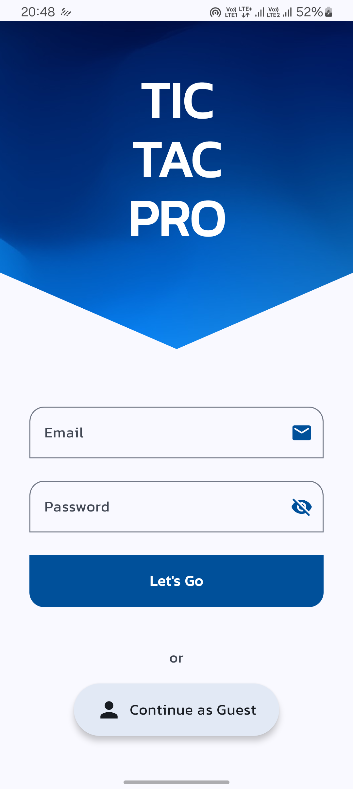

# Tic Tac Pro: *Multiplayer Game*

<p align="center">
  
  
  
  
  
  
  
</p>

## Overview
**Tic Tac Pro** is an engaging multiplayer Android game that lets you challenge your friends either online or offline. The game offers intuitive controls, seamless gameplay, and a user-friendly interface.

## Features
- **Play Online:** Create or join games using a unique game code.
- **Play Offline:** Quick matches against friends on the same device.
- **Profile Management:** Customize your avatar and display name.
- **Guest Mode:** Play without the need to sign up.
- **Real-time Indicators:** Track your turn, wins, and draws.

## Screenshots

1. **Login Screen**  
   - Sign in with your email or as a guest.
   - Automatic registration for new users.

2. **Home Screen**
    - Customize your profile after logging in.
    - Play offline directly or create/join an online game.

3. **Gameplay Screen**  
   - **Online Play:** Wait for an opponent, then take turns marking the board.
   - **Offline Play:** Enter player names, choose turns, and start the game.

4. **Profile Screen**
   - Accessible via the avatar icon on the Home Screen.
   - Edit your avatar and display name.

## Getting Started

### Prerequisites
- Android Studio (latest version)
- Kotlin
- Minimum SDK level: [Your SDK version]
- Gradle (latest version)

### Setup Instructions

1. **Clone the repository:**
   ```bash
   git clone https://github.com/your-username/tic-tac-pro.git
